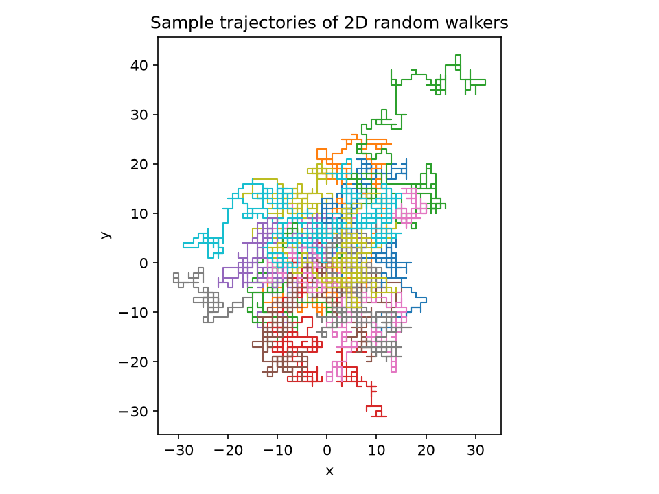
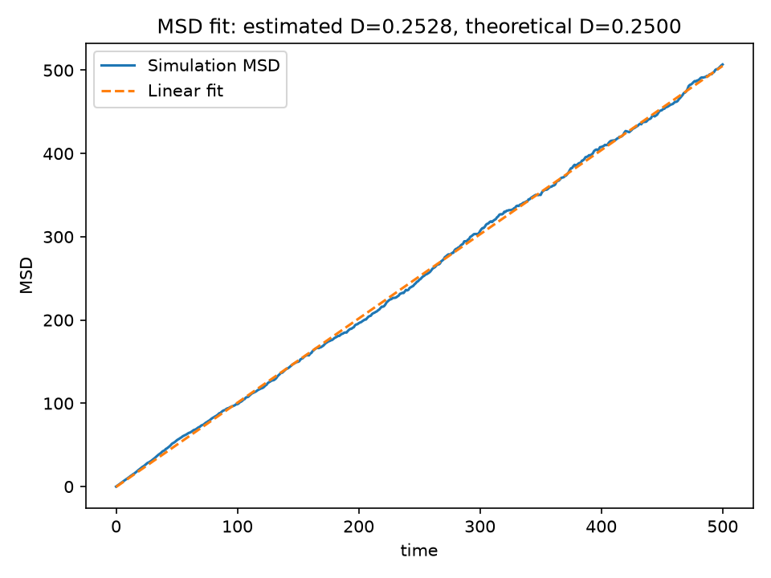

# DiffusionLab

DiffusionLab is a lightweight Python package and command-line tool for simulating two-dimensional lattice random walks, calculating the mean squared displacement (MSD), and estimating the diffusion coefficient.

This README uses **macOS commands**. The project is designed to be reproducible, modular, tested, and usable on a machine other than the one on which it was developed.

## Project goal

The project demonstrates how microscopic random motion produces macroscopic diffusion.

Many independent particles start at the origin and perform a random walk on a two-dimensional square lattice. Their trajectories are recorded, the ensemble MSD is calculated, and the numerical diffusion coefficient is obtained from a linear fit.

## Scientific model

At every time step, each particle moves with equal probability in one of four directions:

```math
\Delta \mathbf{r} \in
\left\{
(a,0),\,(-a,0),\,(0,a),\,(0,-a)
\right\},
```

where $a$ is the step length.

For $N$ particles, the mean squared displacement from their initial positions is

```math
\mathrm{MSD}(t)
=
\frac{1}{N}
\sum_{i=1}^{N}
\left[
\left(x_i(t)-x_i(0)\right)^2
+
\left(y_i(t)-y_i(0)\right)^2
\right].
```

All particles in this implementation start at $(0,0)$, so this becomes

```math
\mathrm{MSD}(t)
=
\frac{1}{N}
\sum_{i=1}^{N}
\left[x_i^2(t)+y_i^2(t)\right].
```

For unrestricted diffusion in two dimensions,

```math
\mathrm{MSD}(t)=4Dt,
```

where $D$ is the diffusion coefficient.

For a lattice walk with step length $a$ and time interval $\Delta t$,

```math
\mathrm{MSD}(n)=na^2,
\qquad
t=n\Delta t,
```

and therefore

```math
D_{\mathrm{theory}}
=
\frac{a^2}{4\Delta t}.
```

The program fits the simulated data with

```math
\mathrm{MSD}(t)\approx mt+b
```

and estimates the diffusion coefficient from the fitted slope $m$:

```math
D_{\mathrm{estimated}}=\frac{m}{4}.
```

The intercept $b$ is not forced to zero. A small non-zero intercept is expected in a finite stochastic simulation.

## Main features

- Reproducible simulations controlled by an explicit random seed
- JSON configuration files, so users do not need to edit source code
- Unrestricted and reflecting-boundary random walks
- Separate simulation, analysis, plotting, and file-I/O modules
- CSV and JSON output files
- Particle-trajectory and MSD-fit figures
- Command-line interface
- Automated tests with `pytest`

## Requirements

- macOS
- Python 3.10 or newer
- NumPy 1.23 or newer
- pandas 1.5 or newer
- Matplotlib 3.6 or newer
- pytest 7 or newer for testing
- coverage.py 7 or newer for optional coverage measurement

Check the installed Python version:

```bash
python3 --version
```

If Python is not installed, install a current Python 3 release before continuing.

## Installation on macOS

Clone the public repository:

```bash
git clone https://github.com/mingqiuyang011/diffusionlab.git
cd diffusionlab
```

Create a virtual environment:

```bash
python3 -m venv .venv
```

Activate it:

```bash
source .venv/bin/activate
```

After activation, the terminal prompt should normally begin with `(.venv)`.

Upgrade `pip`:

```bash
python -m pip install --upgrade pip
```

Install the package and its development dependencies:

```bash
python -m pip install -e ".[dev]"
```

Check that the installed dependencies are consistent:

```bash
python -m pip check
```

Check that the command-line interface is available:

```bash
diffusionlab --help
```

To leave the virtual environment later, run:

```bash
deactivate
```

## Quick start

Run the included free-diffusion example:

```bash
diffusionlab --config configs/free_walk.json --out results/free_walk
```

> The current command-line interface uses `--config` and `--out` directly. It does not use a `run` subcommand.

The command performs the complete workflow:

1. Load and validate the configuration.
2. Simulate the particle trajectories.
3. Calculate the MSD.
4. Fit the MSD curve and estimate $D$.
5. Save numerical outputs.
6. Generate the trajectory and MSD plots.

## Configuration

The example `configs/free_walk.json` contains:

```json
{
  "n_particles": 1000,
  "n_steps": 500,
  "step_length": 1.0,
  "time_step": 1.0,
  "seed": 42,
  "boundary": "none",
  "box_size": null,
  "save_every": 1
}
```

| Parameter | Description | Valid value |
| --- | --- | --- |
| `n_particles` | Number of independent particles | Positive integer |
| `n_steps` | Number of random-walk steps | Positive integer |
| `step_length` | Lattice step length $a$ | Positive number |
| `time_step` | Time interval $\Delta t$ per step | Positive number |
| `seed` | Random seed used for reproducibility | Integer |
| `boundary` | Boundary condition | `"none"` or `"reflecting"` |
| `box_size` | Side length of the reflecting square | Positive for a reflecting boundary; otherwise `null` |
| `save_every` | Save one state every specified number of steps | Positive integer |

Invalid user-facing parameters are rejected with informative exceptions.

## Generated output

The quick-start command creates:

```text
results/free_walk/
├── trajectories.csv
├── msd.csv
├── summary.json
├── trajectories.png
└── msd_fit.png
```

| File | Contents |
| --- | --- |
| `trajectories.csv` | Position of every particle at every saved step |
| `msd.csv` | Simulation step, physical time, and MSD |
| `summary.json` | Fit parameters, estimated and theoretical $D$, relative error, and configuration metadata |
| `trajectories.png` | Sample particle trajectories |
| `msd_fit.png` | Simulated MSD and its fitted line |

Generated result files are ignored by Git because they can be reproduced from the configuration and source code. Two small example figures are stored in `docs/images/` for display in this README.

## Example result

The displayed example was generated with:

| Setting | Value |
| --- | ---: |
| Number of particles | 1000 |
| Number of steps | 500 |
| Step length $a$ | 1.0 |
| Time step $\Delta t$ | 1.0 |
| Random seed | 42 |
| Boundary condition | None |

For these parameters,

```math
D_{\mathrm{theory}}
=
\frac{1^2}{4(1)}
=
0.25.
```

The generated `summary.json` contains:

| Quantity | Result |
| --- | ---: |
| Fitted slope $m$ | 1.0113316342 |
| Fitted intercept $b$ | -0.4918985773 |
| Estimated $D=m/4$ | 0.2528329086 |
| Theoretical $D$ | 0.2500000000 |
| Relative error | 1.1332% |

The numerical estimate is close to the theoretical value. The difference is expected because the MSD is calculated from a finite ensemble of random trajectories.

The final recorded MSD at $t=500$ is `506.926`, while the theoretical ensemble expectation is `500`.

### Example particle trajectories



Individual trajectories are irregular. The diffusion law appears only after averaging over the ensemble of particles.

### MSD and linear fit



The approximately linear MSD curve is consistent with unrestricted diffusion. The fitted slope is used to estimate $D$.

## Additional experiments

### Effect of step length

Run the included configurations:

```bash
diffusionlab --config configs/step_length_05.json --out results/step_length_05
diffusionlab --config configs/step_length_20.json --out results/step_length_20
```

For fixed $\Delta t=1$, theory predicts:

| Step length $a$ | Theoretical $D=a^2/(4\Delta t)$ |
| ---: | ---: |
| 0.5 | 0.0625 |
| 1.0 | 0.25 |
| 2.0 | 1.0 |

Thus,

```math
D\propto a^2.
```

### Reflecting boundary

Run the confined example:

```bash
diffusionlab --config configs/reflecting_box.json --out results/reflecting_box
```

With reflecting boundaries, particles remain inside a finite square. The MSD initially grows, then slows and approaches a plateau.

The free-space relation $\mathrm{MSD}=4Dt$ applies only before confinement dominates. A linear fit over the entire confined trajectory should therefore not be interpreted as a free-space diffusion coefficient.

## Testing on macOS

Activate the project environment before running tests:

```bash
source .venv/bin/activate
```

Run the full test suite:

```bash
pytest -v
```

The current suite contains 11 tests covering:

- Configuration loading and validation
- Initialization at the origin
- Correct lattice-step length
- Reproducibility for a fixed random seed
- Reflecting-boundary behavior
- MSD calculation for hand-checked data
- Diffusion-coefficient fitting for known linear data
- CSV and JSON input/output behavior

Measure coverage with:

```bash
coverage erase
coverage run -m pytest
coverage report -m
```

Tests should pass before a commit is submitted.

## Project structure

```text
diffusionlab/
├── diffusionlab/
│   ├── __init__.py
│   ├── config.py
│   ├── random_walk.py
│   ├── analysis.py
│   ├── plotting.py
│   ├── io.py
│   └── cli.py
├── tests/
│   ├── test_config.py
│   ├── test_random_walk.py
│   ├── test_analysis.py
│   └── test_io.py
├── configs/
│   ├── free_walk.json
│   ├── step_length_05.json
│   ├── step_length_20.json
│   └── reflecting_box.json
├── docs/
│   └── images/
│       ├── trajectories.png
│       └── msd_fit.png
├── results/                 # generated locally and ignored by Git
├── figures/                 # generated locally and ignored by Git
├── README.md
├── pyproject.toml
├── .gitignore
└── LICENSE
```

Module responsibilities:

- `config.py` loads and validates user configuration.
- `random_walk.py` performs the simulation.
- `analysis.py` calculates the MSD and fits the diffusion coefficient.
- `io.py` reads and writes numerical data.
- `plotting.py` only creates visualizations.
- `cli.py` combines the modules into a user-facing workflow.

## Reproducibility

A run is defined by:

1. The JSON configuration.
2. The random seed.
3. The documented dependency versions.
4. The command-line invocation.

Using the same configuration and seed produces the same simulated trajectories with compatible dependency versions. The source code contains no machine-specific absolute paths.

## Clean-clone verification on macOS

The following procedure simulates installation on another machine:

```bash
cd ..
rm -rf diffusionlab_clean_test
git clone https://github.com/mingqiuyang011/diffusionlab.git diffusionlab_clean_test
cd diffusionlab_clean_test
python3 -m venv .venv
source .venv/bin/activate
python -m pip install --upgrade pip
python -m pip install -e ".[dev]"
python -m pip check
pytest -v
diffusionlab --config configs/free_walk.json --out results/clean_test
```

Inspect the generated files:

```bash
ls -lh results/clean_test
python -m json.tool results/clean_test/summary.json
```

Check the documentation images:

```bash
test -f docs/images/trajectories.png && echo "trajectories image: OK"
test -f docs/images/msd_fit.png && echo "MSD image: OK"
```

## Limitations

- The model uses a discrete square lattice rather than continuous Brownian motion.
- Particles are independent and do not interact.
- External forces, hydrodynamic effects, and spatially varying diffusion are not included.
- Statistical uncertainty decreases with more particles, but runtime, memory use, and output-file size increase.
- Storage use is proportional to the number of particles multiplied by the number of saved time steps.
- A free-diffusion linear fit is not physically appropriate after a reflecting-boundary simulation enters its confined regime.

## Author

mingqiuyang011

## License

See the `LICENSE` file for the terms under which this project may be used.
